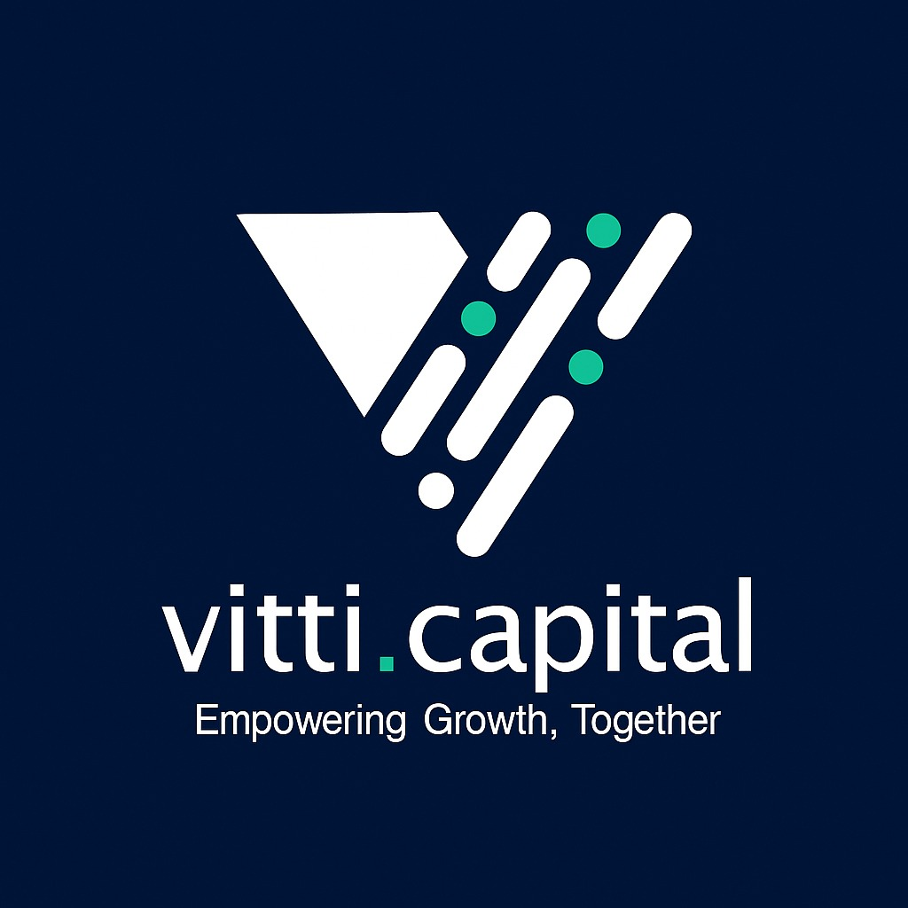

  

<h1 align="center">VITTI Hub</h1>

Internal operations portal for VITTI Capital.

---

VITTI Hub is a private, PIN-protected portal that brings all of VITTI Capital's internal dashboards and analytics tools into one place. Instead of managing separate links and bookmarks, everything is accessible from a single secure page.

To access it, open the portal URL in your browser. You will be prompted to enter a 4-digit PIN. Once verified, you will have direct access to all internal tools and operations running under VITTI Capital.

Access is restricted to authorised personnel only. To request the PIN, contact the VITTI Capital team directly.

---

This project is licensed under the [MIT License](./LICENSE).
